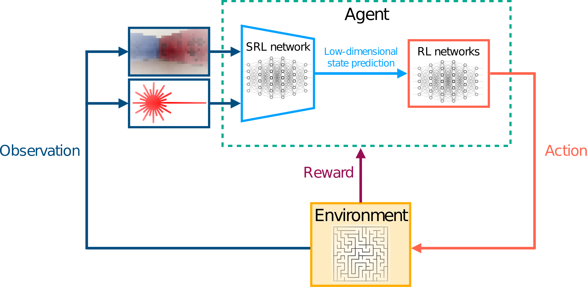

# State Representation Learning With Robotics Priors

Code accompanying the paper:

**Low Dimensional State Representation Learning with Robotics Priors in Continuous Action Spaces**\
Nicolò Botteghi, Khaled Alaa, Mannes Poel, Beril Sirmacek, Christoph Brune, Abeje Mersha, Stefano Stramigioli
The full paper, published at IROS-2021, can be found at: [Link](https://ieeexplore.ieee.org/abstract/document/9635936).

**Low Dimensional State Representation Learning with Reward-Shaped Priors**\
Nicolò Botteghi, Ruben Obbink, Daan Geijs, Mannes Poel, Beril Sirmacek, Christoph Brune, Abeje Mersha, Stefano Stramigioli
The full paper, published at ICPR-2021, can be found at: [Link](https://ieeexplore.ieee.org/abstract/document/9412421)

**Framework**


**Abstract:** 
Autonomous  robots  require  high  degrees  of  cognitive   and   motoric   intelligence to   come   into   our   
everyday life. 
In  non-structured  environments  and  in  the  presence  of uncertainties, such   degrees   of   intelligence   
are   not   easy   to obtain.  Reinforcement  learning  algorithms  have  proven  to  be capable of solving complicated 
robotics tasks in an end-to-end fashion without any need for hand-crafted features or policies. Especially  in  the  
context  of  robotics,  in  which  the  cost  of  real-world  data  is  usually  extremely  high,  Reinforcement  
Learning solutions  achieving  high  sample  efficiency  are  needed.  In  this paper,  we  propose  a  framework  
combining  the  learning  of a  low-dimensional  state  representation,  from  high-dimensional observations  coming  
from  the  robot’s  raw  sensory  readings, with the learning of the optimal policy, given the learned state 
representation. We  evaluate  our  framework  in  the  context  of mobile  robot  navigation. Moreover, we study the problem of transferring what  learned  in  the  simulated  
virtual  environment  to  the  real robot  without  further  retraining  using  real-world  data  in  the presence   
of   visual   and   depth   distractors, such   as   lighting changes and moving obstacles. 
Videos of our experiments can be  found  at: [Link](https://youtu.be/rUdGPKr2Wuo) and [Link](https://youtu.be/dgWxmfSv95U).


## Getting Started

These instructions will get you a copy of the project up and running on your local machine

### Prerequisites

* Python 2.7
* PyCharm

### Installing

Pull the project
```
git clone git@github.com:nicob15/StateRepresentationWithRoboticsPriors.git 
```

Libraries required for running the main code:
```
pip install tensorflow-gpu==1.14
pip install tensorflow-probability==0.7
pip install dm-sonnet==1.35
```
Libraries required for plotting:
```
pip install matplotlib
pip install multicoreTSNE
pip install sklearn
```
Running SRL_RoboticsPriors_ContinuousActions requires a data set of the type:
```
(o,a,r,d,s)
where
o --> observation (see our paper for more info)
a --> action
r --> reward
d --> done
s --> sample number
```
An example of data set can be downloaded from: https://surfdrive.surf.nl/files/index.php/s/34IjGfYd0IAr4Pn

### Simulation Platform
The complete ROS-Gazebo simulation platform used in our experiments can be found at: [Link](https://github.com/KhMustafa/SRL-with-robotics-priors)

### Cite
If you use this code in your own work, please cite our papers:
```
@INPROCEEDINGS{9635936,

  author={Botteghi, Nicolò and Alaa, Khaled and Poel, Mannes and Sirmacek, Beril and Brune, Christoph and Mersha, Abeje and Stramigioli, Stefano},

  booktitle={2021 IEEE/RSJ International Conference on Intelligent Robots and Systems (IROS)}, 

  title={Low Dimensional State Representation Learning with Robotics Priors in Continuous Action Spaces}, 

  year={2021},

  volume={},

  number={},

  pages={190-197},

  doi={10.1109/IROS51168.2021.9635936}}


@INPROCEEDINGS{9412421,

  author={Botteghi, Nicolò and Obbink, Ruben and Geijs, Daan and Poel, Mannes and Sirmacek, Beril and Brune, Christoph and Mersha, Abeje and Stramigioli, Stefano},

  booktitle={2020 25th International Conference on Pattern Recognition (ICPR)}, 

  title={Low Dimensional State Representation Learning with Reward-shaped Priors}, 

  year={2021},

  volume={},

  number={},

  pages={3736-3743},

  doi={10.1109/ICPR48806.2021.9412421}}

```

